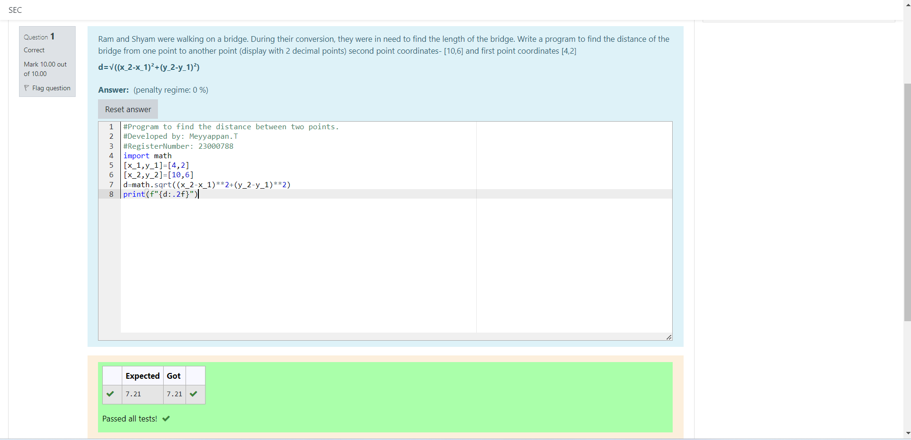

# DISTANCE-BETWEEN-TWO-POINTS

## AIM:
To write a python program to find the distance two 2 points
## ALGORITHM:
### Step 1: 
Import the math function
### Step 2: 
Make two lists which consist of two variables and initialize them
### Step 3: 
Substitute the values in the distance formula
 
### Step 4:
We do this by using the sqrt function 
### Step 5:
Print the value 
## PROGRAM:
```py
#Program to find the distance between two points.
#Developed by: Meyyappan.T
#RegisterNumber: 23000788
import math
[x_1,y_1]=[4,2]
[x_2,y_2]=[10,6]
d=math.sqrt((x_2-x_1)**2+(y_2-y_1)**2)
print(f"{d:.2f}")
```
## OUTPUT:


## RESULT:
Thus the distance between two points is found